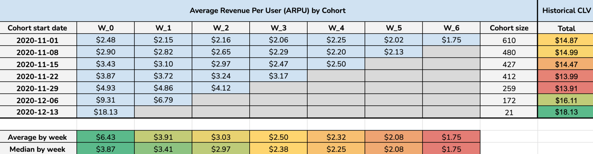
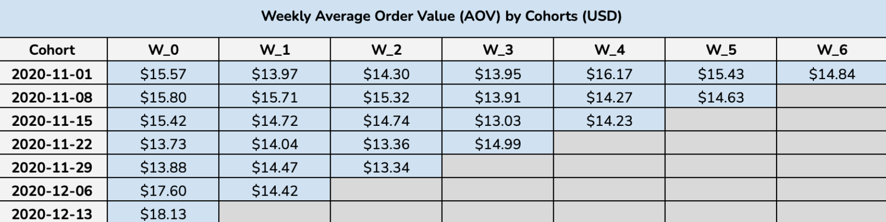
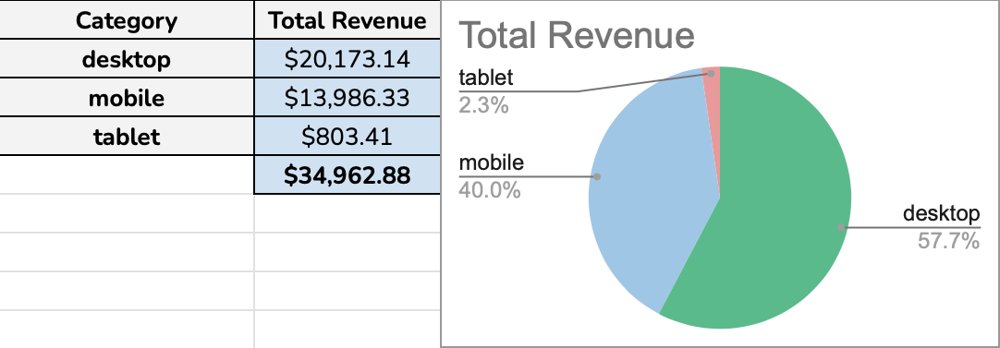
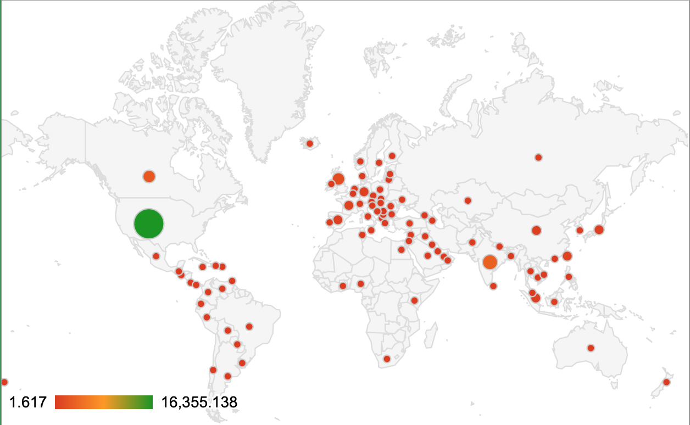

# Customer Lifetime Value (CLV) Analysis ✨

This project presents a comprehensive Customer Lifetime Value (CLV) analysis, performed within **Google Sheets**. The goal was to understand customer behavior, identify key revenue drivers, and provide actionable insights to enhance long-term customer value and inform strategic business decisions by analyzing various cohorts and revenue metrics.

**Primary objectives :**
* Calculate and visualize key customer lifetime value metrics.
* Identify trends in customer revenue contribution over time.
* Uncover insights into customer behavior across different segments (e.g., device categories, regions).
* Provide data-driven recommendations for optimizing customer acquisition, engagement, and retention strategies.

**Tasks performed:**
* **Metric Calculation:** deriving key metrics such as Average Revenue Per User (ARPU), Average Order Value (AOV), and Historical CLV using formulas.
* **Cohort Analysis:** Grouping users by their acquisition period to track their revenue contribution over subsequent weeks.
* **Dashboard Creation:** Designing corresponding tables and graphs to visualize findings and enable easy exploration of data.

---

## 📊 Key metrics defined

* **Average Revenue Per User (ARPU) by Cohort:** Tracks the average revenue generated by users from different acquisition cohorts over time.
* **Average & Median ARPU by Week:** Displays weekly average and median revenue contributions for all available cohorts, offering insights into typical user value and the impact of outliers.
* **Revenue by Category (Mobile, Desktop, Tablet):** Breaks down total revenue based on the device category used by customers.
* **Historical CLV:** Presents the cumulative revenue generated by customer cohorts over their lifetime.
* **Weekly Average Order Value (AOV) by Cohorts:** Shows the average value of individual orders placed by users within specific cohorts on a weekly basis.
* **Revenue by Country:** Details revenue contributions from different geographical regions.
* **Top Countries by Revenue:** A summarized view of leading countries by revenue, including their percentage contribution to the total.
  
  | Country        | Total Revenue   | % of Total |
  | :------------- | :-------------- | :--------- |
  | United States  | \$16,355.14     |            |
  | India          | \$3,339.06      |            |
  | Canada         | \$2,543.43      |            |
  | United Kingdom | \$1,635.22      |            |
  | **Total** | **\$23,872.85** | 68.28%     |

---

## 💡 Key Insights

The analysis of customer data revealed several critical insights:

* **Desktop Dominance:** desktop users are the primary revenue drivers, accounting for a significant 57.7% of total revenue. This clearly indicates that the current business heavily relies on desktop transactions.
* **ARPU Decline Post-Acquisition:** across nearly all cohorts, the Average Revenue Per User (ARPU) consistently declines from Week 0 onwards. This suggests a challenge in retaining user value beyond the initial purchase period.
* **Inconsistent Weekly Average Order Value (AOV):** there isn't a clear upward or downward trend across weeks for most cohorts, suggesting that while the number of orders might change, the average value of each order remains relatively stable once a user is acquired.
* **Higher Initial ARPU in Newer Cohorts:** newer cohorts are showing higher initial ARPU. This could indicate more effective recent acquisition strategies or a positive change in the user demographic being acquired.
* **Impact of Outliers on ARPU:** the median ARPU consistently stays lower than the average ARPU, indicating that there might be some outlier users with very high ARPU pulling the average up, but the typical user's revenue contribution drops more sharply.

---

## ✅ Key Suggestions

* **Optimize Desktop User Experience & Conversion:** prioritize continuous optimization of the desktop website/application for user experience, conversion rates, and upselling opportunities, given its critical role in revenue generation.
* **Investigate Mobile Potential:** analyze mobile user behavior in detail to identify opportunities for improved mobile-first experiences, app development, or mobile-specific marketing to potentially convert more mobile users into higher-value customers.
* **Develop Retention Strategies to Boost ARPU:** implement targeted strategies to combat the observed decline in ARPU over time. This could include loyalty programs, personalized offers, re-engagement campaigns, or subscription tier upgrades.
* **Analyze Recent Cohort Success:** conduct a deep dive into the acquisition channels and marketing strategies used for the higher-performing recent cohorts to identify best practices that can be scaled.
* **Segment Users for Tailored Engagement:** segment users based on their initial ARPU, cohort behavior, and device preference. This allows for more personalized marketing and product development efforts, addressing specific needs and maximizing lifetime value for different user groups.

---

## 📊 Access Dataset and Google Sheets File

[**Access the CLV file here**](https://docs.google.com/spreadsheets/d/1AIy3eBdK2lqzSnvG1f0R7K1IeKKsH55tfMEwGNa2veM/edit?gid=11778143#gid=11778143)

[**Original dataset**](data/dataset_clv.csv)

## 📸 Project Snapshots

Here are some screenshots of the Google Sheets file, showcasing its design and key components:

*A close-up of the Average Revenue Per User by Cohort table, detailing weekly ARPU trends, as well as Historical CLV.*

*A close-up of the Average Order Value by Cohort table, detailing weekly AOV trends.*

*A table and pie chart showing revenue distribution across device categories: mobile, desktop, and tablet.*

*A graph presenting revenue sources by country.*
